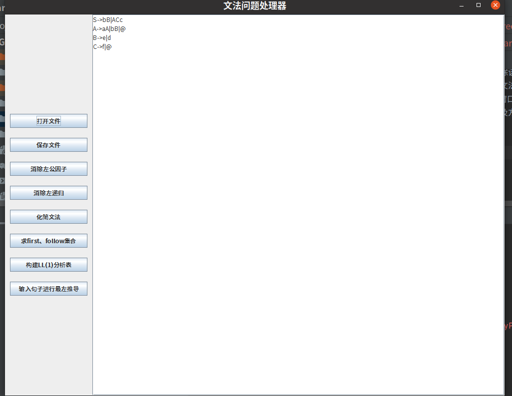
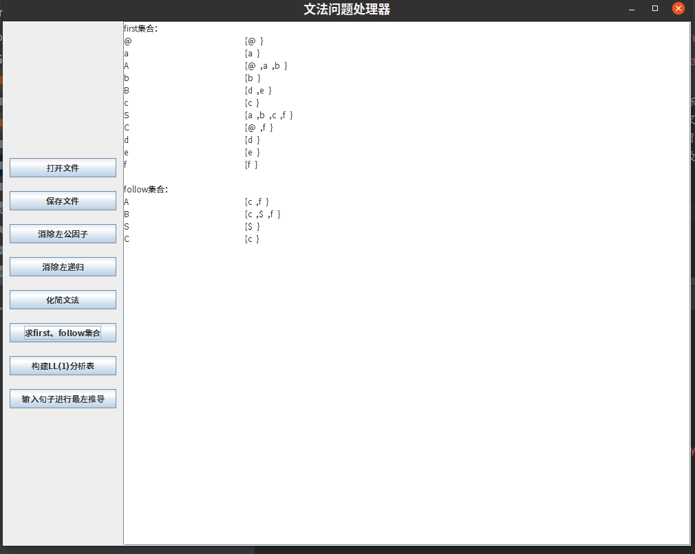
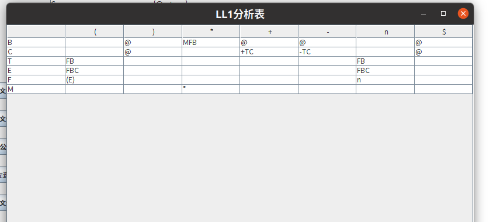
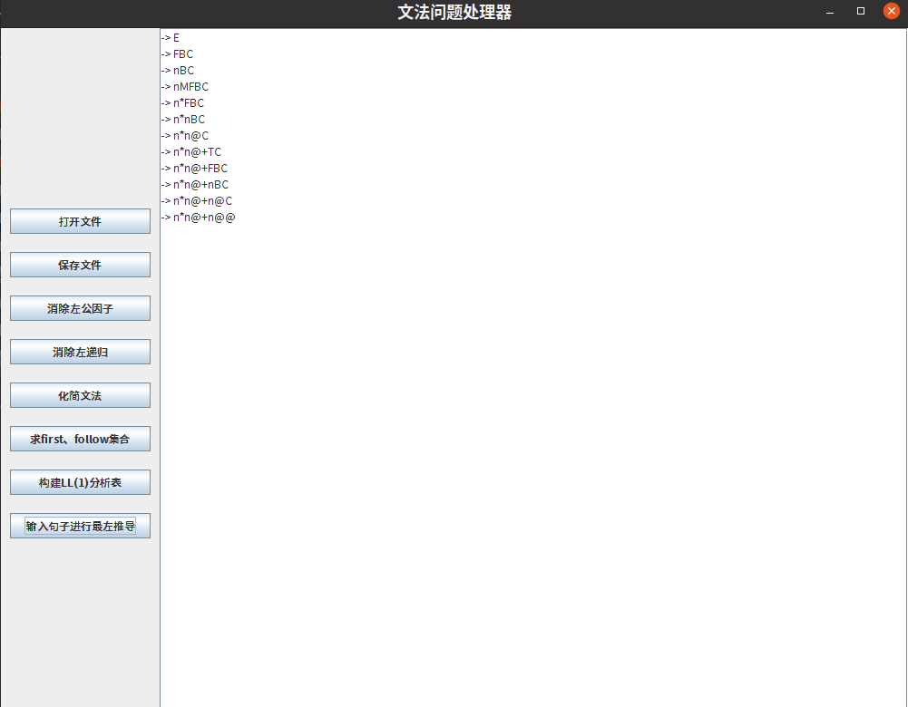

实验三：文法问题处理器

一、实验内容：
设计一个应用软件，以实现文法的化简及各种问题的处理。

二、实验要求：
（1）系统需要提供一个文法编辑界面，让用户输入文法规则（可保存、打开存有文法规则的文件）
（2）化简文法：检查文法是否存在有害规则和多余规则并将其去除。系统应该提供窗口以便用户可以查看文法化简后的结果。
（3）检查该文法是否存在着左公共因子（可能包含直接和间接的情况）。如果存在，则消除该文法的左公共因子。系统应该提供窗口以便用户可以查看消除左公共因子的结果。
（4）检查该文法是否存在着左递归（可能包含直接和间接的情况），如果存在，则消除该文法的左递归。系统应该提供窗口以便用户可以查看消除左递归后的结果。
（5）求出经过前面步骤处理好的文法各非终结符号的first集合与follow集合，并提供窗口以便用户可以查看这些集合结果。【可以采用表格的形式呈现】
（6）对输入的句子进行最左推导分析，系统应该提供界面让用户可以输入要分析的句子以及方便用户查看最左推导的每一步推导结果。【可以采用表格的形式呈现推导的每一步结果】

